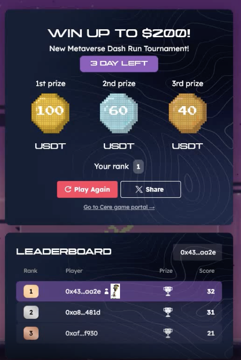

# CerePlay Games SDK Enhancement: Custom Achievements & UI Themes

- **Proposer:** [Your Organization Name](Link)
- **Payment Address:** [Your Payment Address]

## Project Description

[Your Organization Name] is offering an enhancement to the Cere Gaming SDK to enable the tracking of in-game activities and achievements. This upgrade is inspired by the desire to allow gamers to view unique achievement icons on the leaderboard based on specific in-game events. For instance, if Player A eliminates 100 enemies in the game, leading in the "Enemies Killed" category, a distinct achievement icon should be displayed on the leaderboard. This icon represents a special achievement, not necessarily the 1st place.

## Use-Case
Scenario: As a gamer, when I achieve specific milestones in a game, I want to see a unique achievement icon on the leaderboard, distinct from the regular 1st, 2nd, or 3rd place icons.
Example: If Player A eliminates 100 enemies in a game and leads in the "Enemies Killed" category, the leaderboard should display a special achievement icon for Player A, signifying this accomplishment.

Key features to be added include:
1. Enhancement of Cere Gaming SDK to monitor in-game actions and achievements.
2. Display of achievement icons on the leaderboard when players meet certain criteria (e.g., highest number of kills, most levels completed).
3. Introduction of new SDK methods for transmitting custom/system events in the form of arbitrary JSON data.

## Requirements
Enhance the Cere Gaming SDK to support the tracking of custom in-game activities and achievements. The SDK should be capable of saving and retrieving JSON data, which can then be integrated into the Leaderboard UI. This will allow the leaderboard to showcase specific achievement icons based on custom events.

## Key Features
SDK Enhancement: Upgrade the Cere Gaming SDK to monitor custom in-game actions and achievements.
Achievement Display: Show achievement icons on the leaderboard when a player meets predefined criteria.

* Store meta-data and digital asset data (png's) on DDC.
* User profiles should contain achievement data.
* Link icons with corresponding achievements.
* Make the leaderboard extendable to display more user profile data, especially achievement icons.
* Design considerations for displaying multiple achievements. 
 * Support multiple ahchievements.
 * Support clickable user profiles to reveal detailed achievements.
* It contains achievement icons saved to DDC and retrieved from DDC. 
 * Icons should be saved on user bases per the game. 
 * Achievements should be linked to the user and icon can be customizable. 
 * Leaderboard has to maintain extensions for user profiles in order to let this implementation to be done.


# **Read/Write/Update Achievement's on DDC with customer Leadeboard UI**

## Development Roadmap
- **Total Duration:** [Total Duration]
- **Total Costs:** [Total Cost]

### Milestone 1: SDK Method Enhancements
Achievements: Introduce new SDK methods to read/write/update custom 'achievement' events in the form of arbitrary JSON data. 

- **Estimated Duration:** [Duration]
- **Costs:** [Cost]

1. New SDK Methods: Introduction of new SDK methods for transmitting custom/system events in the form of arbitrary JSON data.
1. Data Validation: While the SDK should offer extension points for validation, developers must ensure data accuracy. For instance, discrepancies like a player claiming 3 hours of playtime in a 15-second session should be flagged.
2. Data Analysis: Events should be collected on the Cere side for future analysis, offering game developers potential restoration points. This data can also aid in constructing an analytics board for activity tracking.
3. Security Mechanism: The SDK should provide mechanisms to assist developers in performing security checks.

Example 1: 
``` 
{"fruits_collected": 10}
```

Example 2:
```
{
   "progress":{
      "achievements":{
         "cars_stolen": 1
      }
   }
}
```


### Milestone 2: Leaderboard UI Enhancements
Achievements: UI Components should should support showing achievements.

- **Estimated Duration:** [Duration]
- **Costs:** [Cost]

1. Customiazble UI: components to display the Leaderboard Screen data, which can encompass custom icons, font customizations, dialog box modifications, dynamic or static text, and animations.
2. Themes: Maintain a per-game config for uniform appearance across all game developer applications, with references like Metaverse Dash Run.

For example player1 killed 20 zombies and got achievement with zombie icon posted below, Leaderboard could look like the following:




## Community engagement

1. Publish articles on our Blog, Telegram, Discord, and other community channels to highlight each milestone.

### Repository Hierarchy
```
├── ./ [CerePlay SDK Root]
│   ├── ./SDK Method Enhancements
│   ├── ./Leaderboard UI Components
│   ├── ./External Dependencies
```

Repository contains these primary directories:
1. SDK Method Enhancements: Contains tools and scripts for enhancing the SDK to support custom events and achievements.
2. Leaderboard UI Components: Modules for upgrading the UI components of the leaderboard.
3. External Dependencies: Information and updates related to external dependencies like Freeport API/docs.
## Team

- **Team Members:** [Member 1], [Member 2], [Member 3]
- **Team Website:** [Team Website Link]
- **Code Repos:** [Repository Link]
- **Website:**	[Organization Website]
- **Legal Structure:** [Legal Structure Type]
- **Team's Experience:** Brief descriptions of team members' experiences and contributions.

## Additional Information

Relevant additional information:

- **Work Done So Far:** [Description of the work that has been completed.]
- **Previous Contributions:** [Information about any teams or entities that have financially contributed to the project.]
- **Other Grants:** [Information about any other grants applied for or received.]

# Application Process
## Application Submission
1. Fork this repository (branch: master) or git pull to update your existing repo.
2. Create a new branch called Grant App - Project Name.
3. Create a copy of the Application Template file in the Grants/Applications/ directory of your newly created fork.
4. Name the new file after your project: project_name.md.
5. Fill out the template with the details of your project. 💡 That file should contain ALL necessary information for complete evaluation of the proposed grant! And the more information, the faster the review.
6. Review the Terms and Conditions file inside the Documents folder.
7. Once you're done, create a pull request.
 - ⚠️ By initiating a pull request, you are indicating you have ready and accepted the terms and conditions as provided.
8. At this stage, the pull request should only contain one new file — the markdown file you created from the template.

## Application Review
The Cere Foundation Grants Committee will issue comments and request changes on the pull request.
Clarifications and amendments made in the comments need to be included in the application. You may address feedback by modifying your application directly and leaving a comment once you're done.
The application is accepted when all requested changes are addressed, and the terms and conditions have been agreed upon.
The application will be subject to automatic rejection after 2 weeks of inactivity. Unless specified otherwise, the day on which it is accepted will be considered the starting date of the project, and will be used to estimate delivery dates.

## Onboarding
Once your Grant Application (PR) is approved, we will initiate Project Onboarding, where you will:

* be welcomed to the programme with an introduction to the team and an overview of the legal and funding aspects.
* Meet your Project Mentor.
* Plan check-in & Office-Hours schedule.
* Officially Kick-off your project.

## Milestone Review, Delivery, and Payment
At the end of each month and other important milestone, you will need to provide a comprehensive report of the work done, including the list of issues/bugs/pull requests worked on, time spent on each of these & finally the associated cost.
⚠️ Make sure to Use the same GitHub account that submitted the application.

Milestones are to be delivered according to the following instructions:
1. Create a new branch based on the Grant App branch created previously named Milestones - Project Name.
2. Duplicate the Milestone Delivery Template file in the Milestones Delivery folder.
3. If this is your first milestone: Create a new folder in the Milestones Delivery folder you’re in now named $Project Name.
4. Rename the new file to milestone-X.md and move it to the $Project Name folder you created previously.
5. Follow the instructions as shown in the milestone-X.md file created previously.
6. Commit the changes to the new previously created project milestones branch.
7. Prepare a pull request against the original Grants Repository to initiate the review!
8. Finally, submit your invoice to community@cere.io.

🪙 Payment is made in ERC-20 Cere Token or USDC on Ethereum or Polygon Mainnet.

### Changes to a Grant after Approval
Accepted grant applications can be amended at any time. However, doing so necessitates a re-evaluation by the committee and requires the same number of approvals as a new application. If your application has been accepted and during development you find that your project significantly deviates from the original specifications, please open a new pull request that modifies the existing application. This also applies in case of significant delays.

If there are significant changes to your delivery schedule, please open a pull request with an updated timeline.

If your deliveries are delayed by more than 2 weeks without justification or further communication, the committee reserves the right to initiate the Grant Termination Process.

Learn more on the [Grants page](https://github.com/Cerebellum-Network/contribute/tree/achievements/Grants).

[permalink-main](https://github.com/Cerebellum-Network/contribute/blob/achievements/Grants/Active/cereplay-achievement-icons-ddc.md)
