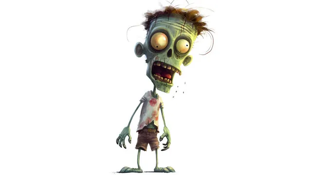

## Use-Case
Scenario: As a gamer, when I achieve specific milestones in a game, I want to see a unique achievement icon on the leaderboard, distinct from the regular 1st, 2nd, or 3rd place icons.
Example: If Player A eliminates 100 enemies in a game and leads in the "Enemies Killed" category, the leaderboard should display a special achievement icon for Player A, signifying this accomplishment.

## Requirements
Enhance the Cere Gaming SDK to support the tracking of custom in-game activities and achievements. The SDK should be capable of saving and retrieving JSON data, which can then be integrated into the Leaderboard UI. This will allow the leaderboard to showcase specific achievement icons based on custom events.

## Key Features
SDK Enhancement: Upgrade the Cere Gaming SDK to monitor custom in-game actions and achievements.
Achievement Display: Show achievement icons on the leaderboard when a player meets predefined criteria.

## Key Deliverables
### Delivery Set 1: SDK Method Enhancements
Custom Event Tracking: Introduce new SDK methods to transmit custom/system events in the form of arbitrary JSON data. These events should be adaptable based on the game's requirements.

Example 1: {"fruits_collected": 10}

Example 2:
{
   "progress":{
      "achievements":{
         "cars_stolen": 1
      }
   }
}

Data Validation: While the SDK should offer extension points for validation, developers must ensure data accuracy. For instance, discrepancies like a player claiming 3 hours of playtime in a 15-second session should be flagged.

Data Analysis: Events should be collected on the Cere side for future analysis, offering game developers potential restoration points. This data can also aid in constructing an analytics board for activity tracking.

Security Mechanism: The SDK should provide mechanisms to assist developers in performing security checks.

Delivery Set 2: Leaderboard UI Enhancements

Consistent UI: Maintain a uniform appearance across all game developer applications, with references like Metaverse Dash Run.

UI Components: Upgrade UI components to display custom achievements on the Leaderboard Screen.

## Technical Requirements
* Store icons on DDC.
* User profiles should contain achievement data.
* Link icons with corresponding achievements.
* Make the leaderboard extendable to display more user profile data, especially achievement icons.
* Design considerations for displaying multiple achievements. Suggestion: Make user profiles clickable to reveal detailed achievements.
* It contains achievement icons saved to DDC and retrieved from DDC. Icons should be saved on user bases per the game. Achievements should be linked to the user and icon can be customizable. Leaderboard has to maintain extensions for user profiles in order to let this implementation to be done.

For example player1 killed 20 zombies and got achievement with zombie icon posted below:
 - 

Additional Notes:
* To ensure a comprehensive and user-friendly experience, designs may be needed if there are numerous achievements. Making user profiles clickable to provide more details can be a potential solution.
* Leaderboard could look like the following:
 - 
